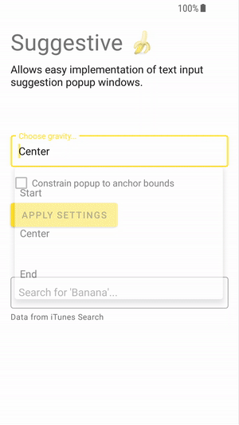

# Suggestive 🍌
An Android UI library that allows easy implementation of (text) input suggestion [popup windows](https://developer.android.com/reference/android/widget/PopupWindow).
- Implement filtering using the onQuery callback
- Creates suggestion popups from RecyclerView adapters
- Creates suggestion popups from any View
- Works and animates well with soft keyboard visibility changes
- Automatically closes on back press if hosted in an AppCompatActivity

# Sample

**Create a suggestion popup from a recycler adapter**  
To create a popup window of a RecyclerView use `Suggestive.recycler()`.  
All named arguments are optional and set to their default in this sample.
```kotlin
// Create a suggestion popup containing a recycler view
Suggestive.recycler(

    // anchor to queryEditText
    queryEditText,
    
    // use the recycler view adapter
    adapter,
    
    // only invoke onQuery at a minimum input of 3 characters
    minCharacters = 3,
            
    // attaches the text change listener that invokes [onQuery]
    attachTextChangeListener = true,
    
    // invoke onQuery with a minimum delay of 200 ms
    onQueryThrottle = 200,
    
    // align the popup to the start of the anchor view
    gravity = Gravity.START,
    
    // use the background drawable for the popup window background
    backgroundDrawable = ContextCompat.getDrawable(this, R.drawable.popup_rounded_bg)!!,
    
    // constrains the popup windows width to the width of anchor
    constrainWidthToAnchorBounds = true,
    
    // hide the popup window when anchor loses focus
    hideOnBlur = true,
    
    // show the popup above or below anchor based on available space around anchor
    preferredPosition = SuggestionWindow.PreferredPosition.BEST_FIT,
    
    // dismisses the popup when the back button is pressed
    dismissOnBackPress = true,
    
    // the input query callback, called for every text change event on anchor
    //  (with exclusions as mandated by the minCharacters and onQueryThrottle options)
    onQuery = { query ->
    vm.search(query)
})
```

**Create a suggestion popup from a view**  
To create a popup window of a view use `Suggestive.view()`, this method takes the same arguments as `recycler()`.
```kotlin
val view: View = //...
Suggestive.view(anchorView, view)
```

**Manipulate the popup manually**  
Both factory methods on the `Suggestive` object return instances of `SuggestionWindow`.  
Use methods on this object to manipulate the popup manually:
```kotlin
val popup = Suggestive.view(anchorView, view)
popup.show() // popup.isHidden = true
popup.hide() // popup.isHidden = false
popup.requestLayout() // relayout the popup content view
```
# Demo
See the demo gif below or try it out on `tbd`.  
